The STEM Data Visualization + Du Bois project is led by an interdisciplinary team from Fisk University, Princeton University, and University of California, Merced. We are supported by a grant from the [National Science Foundation](https://www.nsf.gov/awardsearch/show-award/?AWD_ID=2236219&HistoricalAwards=false).

## Principle Investigators

Dr. Leslie Collins, Associate Professor of Social and Behavioral Sciences, [**Fisk University**](https://www.fisk.edu/biography-leslie-collins/)

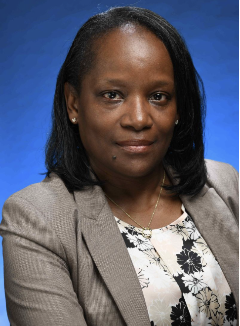

[Dr. Charlie Eaton](https://www.charlieeaton.net), Associate Professor of Sociology, [**University of California, Merced**](https://sociology.ucmerced.edu/content/charlie-eaton)

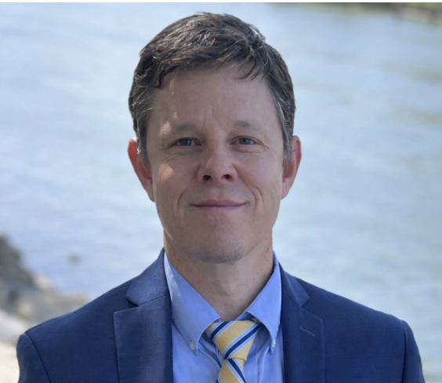

Dr. Frederick Wherry, Townsend Martin Class of 1917 Professor of Sociology, [**Princeton University**](https://sociology.princeton.edu/people/frederick-wherry)

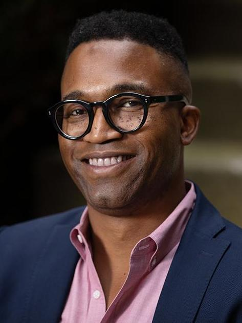

## Co-Principal Investigators:

Dr. Camila Alvarez, Associate Professor of Sociology, [**University of California, San Diego**](https://sociology.ucsd.edu/people/faculty/faculty%20members/camila-alvarez.html)

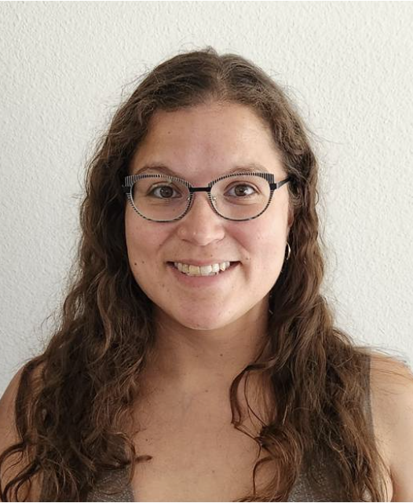

Dr. Jeffrey Himpele, Director, VizE Lab for Ethnographic Data Visualization, [**Princeton University**](https://anthropology.princeton.edu/people/jeffrey-himpele)

Dr. A. Hannibal Hamdallahi, Associate Professor of Political Science, [**Fisk University**](https://www.fisk.edu/academics/a-hannibal-hamdallahi-biography/)

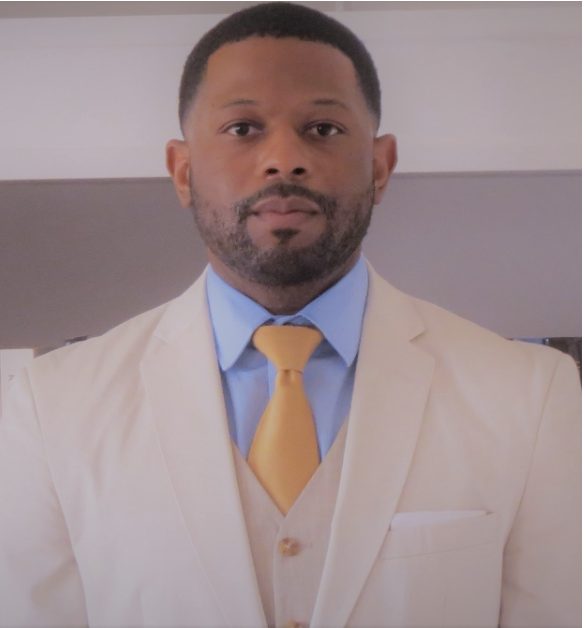

Dr. Whitney Pirtle, Associate Professor of Community Health Sciences and Sociology, Associate Director of the Ralph J. Bunche Center for African American Studies, [**University of California, Los Angeles**](https://bunchecenter.ucla.edu/about/staff/)

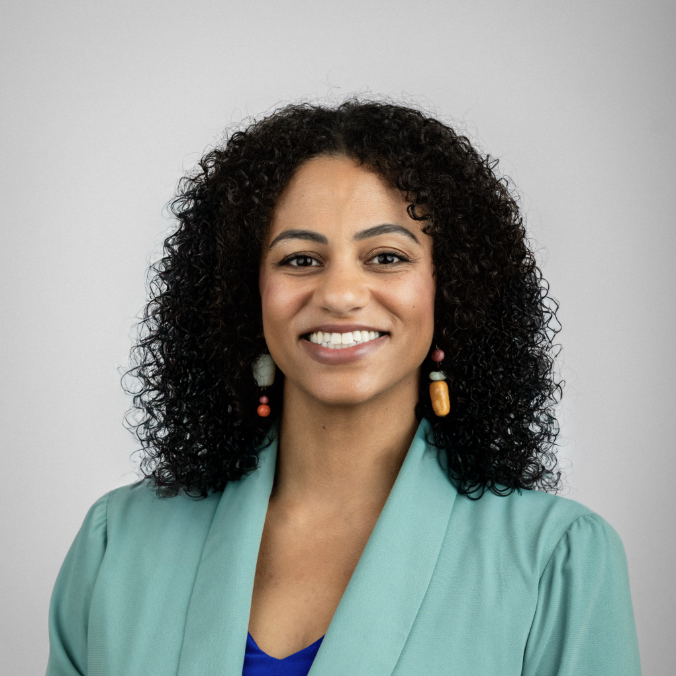

Dr. La Tanya L. (Reese) Rogers, Dean of the School of Humanities & Behavioral Social Sciences, [**Fisk University**](https://www.fisk.edu/biography-la-tanya-l-rogers/)

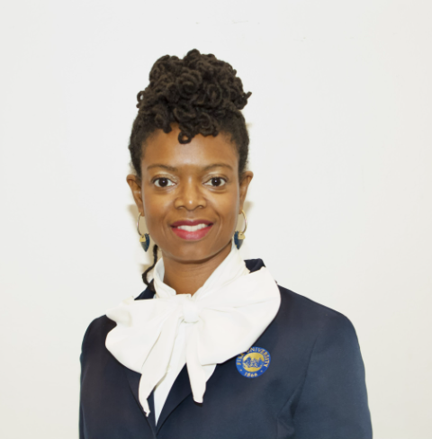

## Consultants

Allen Hillery, Distinguished Lecturer, [**City University of New York Macaulay Honors College**](https://macaulay.cuny.edu/directory/allen-hillery/), #DuBoisChallenge Co-Founder

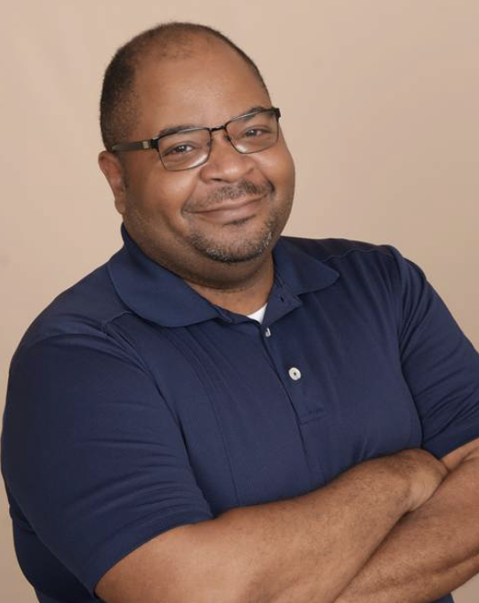

[Anthony Starks](https://speakerdeck.com/ajstarks), independent developer and designer, #DuBoisChallenge Co-Founder

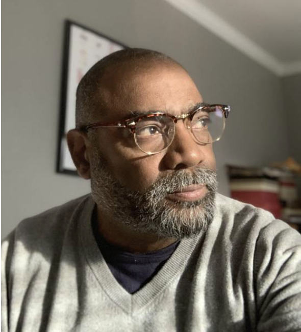

## Postgraduate and Graduate Researchers:

Morgan Allen, Postgraduate Scholar, [**Fisk University**](https://www.instagram.com/p/DT_paTqjy3O/)

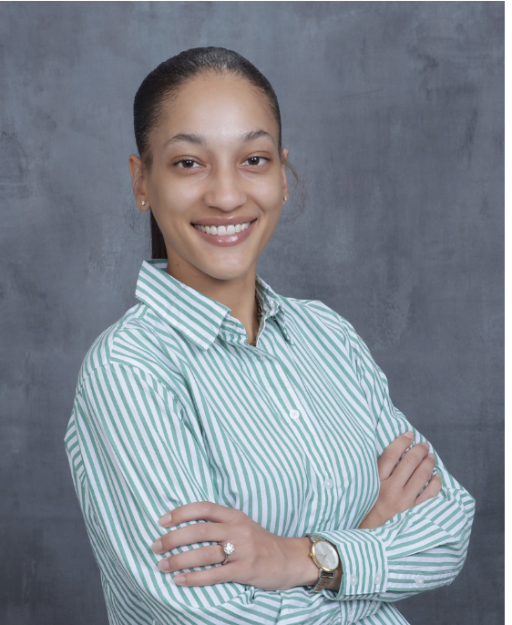

Sarah Avina, Graduate Student in Sociology, [**University of California, Merced**](https://www.linkedin.com/in/sarah-avina-b67515232/)

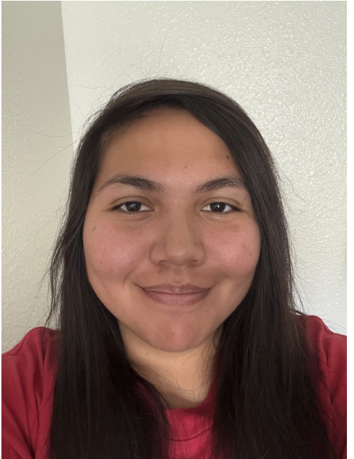

Dr. Leia Belt, Postdoctoral Fellow, [**University of California, Merced**](https://sociology.ucmerced.edu/content/leia-belt)

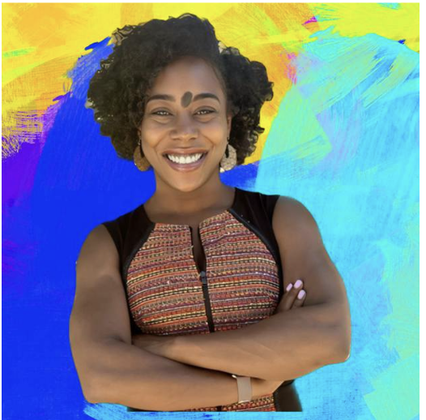

Kimberly Garcia-Galves, PhD Candidate in Sociology, [**University of California, Merced**](https://sociology.ucmerced.edu/content/kimberly-garcia-galvez)

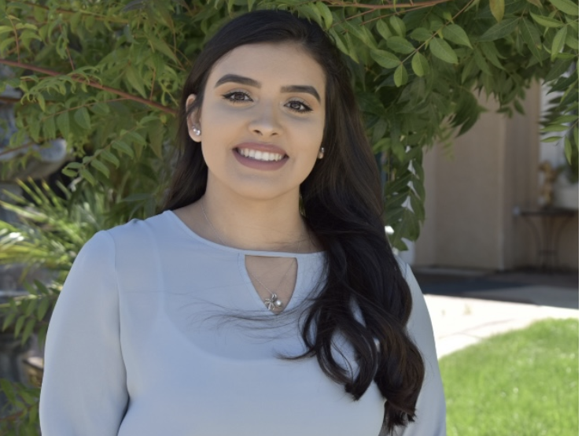

Andrew Martin, Graduate Student in Sociology Department, [**University of California, Merced**](https://sociology.ucmerced.edu/content/andrew-martin)

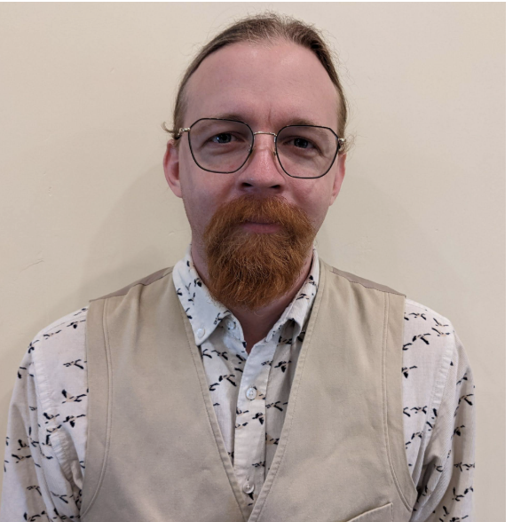
